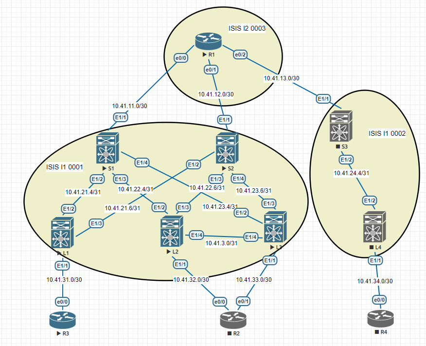

### Лабораторная 3
1. Настроить ISIS в Underlay сети для IP связанности между всеми устройствами сети

#### Топология сети


<details>
  <summary>R1</summary>
<pre><code>
router isis UNDERLAY
 net 49.0003.1001.1001.1001.00
 is-type level-2-only
 authentication mode md5 level-2
 authentication key-chain ISIS_AUTH level-2
 metric-style wide
 
key chain ISIS_AUTH
 key 1
  key-string 7 070827444402143a46
 
interface EthernetN
 ip address 10.41.11.1 255.255.255.252 [//см. таблицу адресации](Lab1.md)
 ip router isis UNDERLAY
 isis circuit-type level-2-only
</code></pre>
 </details>

<details>
  <summary>Spines</summary>
<pre><code>

</code></pre>
 </details>
Leafs

``` router isis UNDERLAY
net 49.0001.1111.1111.1111.00  //уникальный идентификатор для каждого устройства
is-type level-1
authentication-type md5 level-1
authentication key-chain ISIS_AUTH level-1
address-family ipv4 unicast ```

*Настройка авторизации*

`key chain ISIS_AUTH`

`key 1`

`key-string 7 070827444402143a46`

*На каждом интерфейсе, устанавливающем isis-соседство:*

`interface EthernetN`

`description to_S2` 

`no switchport` 

`ip address 10.41.21.6/31 ` [//см. таблицу адресации](Lab1.md)

`ip router isis UNDERLAY`

`isis network point-to-point `

`no shutdown`

*На интерфейсе, объявляющем свою сеть, но не устанавливающем соседство:*

`interface EthernetN`

`description to_R2` 

`no switchport` 

`ip address 10.41.31.1/30 ` [//см. таблицу адресации](Lab1.md)

`ip router isis UNDERLAY`

`isis passive-interface level-1`

`no shutdown`
