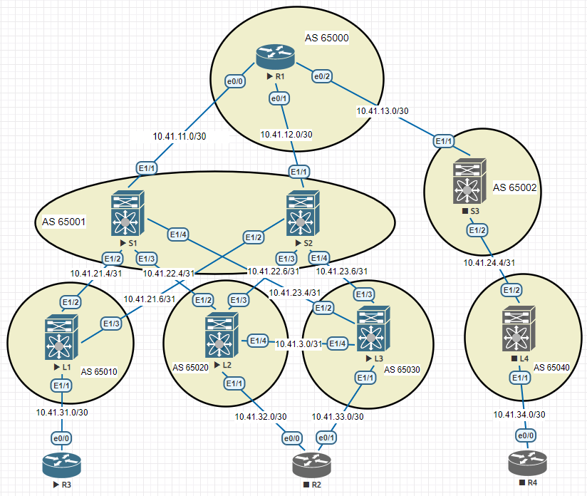

### Лабораторная 4
1. Настроить BGP в Underlay сети для IP связанности между всеми устройствами сети

#### Топология сети

  
R1

<pre><code>
router bgp 65000
 bgp log-neighbor-changes
 neighbor 10.41.11.2 remote-as 65001
 neighbor 10.41.12.2 remote-as 65001
 neighbor 10.41.13.2 remote-as 65002
 !
 address-family ipv4
  network 10.41.11.0 mask 255.255.255.252
  network 10.41.12.0 mask 255.255.255.252
  network 10.41.13.0 mask 255.255.255.252
  neighbor 10.41.11.2 activate
  neighbor 10.41.12.2 activate
  neighbor 10.41.13.2 activate
  maximum-paths 3
</code></pre>

