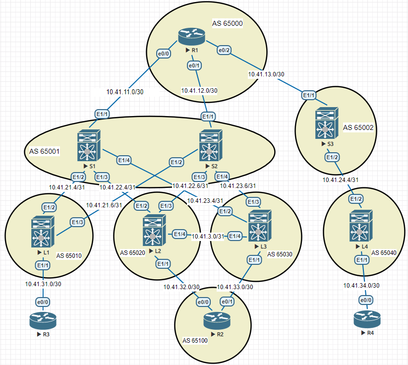

### Лабораторная 5
1. Настроить PIM в сети

#### Топология сети

  
RX

<pre><code>
ip multicast-routing
int ran e0/0-2
 ip pim sparse-mode
</code></pre>

  
Spine

<pre><code>
feature pim
int e1/X
ip pim sparse-mode
</code></pre>

  
Leaves

<pre><code>
feature pim
int e1/X
ip pim sparse-mode
</code></pre>

