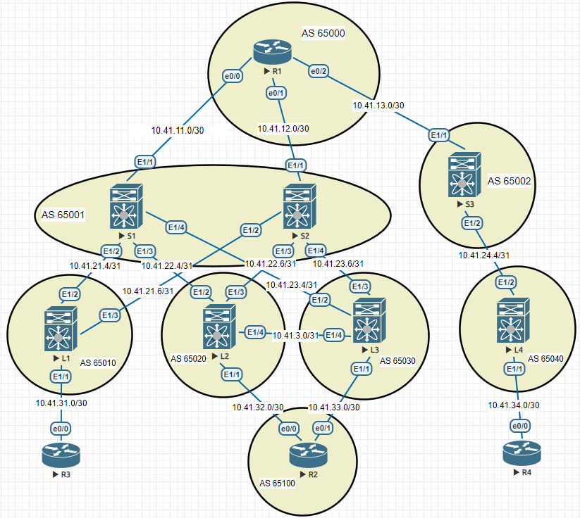

### Лабораторная 6
1. Настроить Overlay на основе VxLAN EVPN для L2 связанности между клиентами

#### Топология сети

  
SPINE

<pre><code>
feature nv overlay
nv overlay evpn

<h5>router bgp 65001</h5>
  address-family ipv4 unicast
    network 10.41.1.1/32
    network 10.41.11.0/30
    network 10.41.21.4/31
    network 10.41.22.4/31
    network 10.41.23.4/31
  template peer LEAF
    update-source loopback0
    address-family l2vpn evpn
      send-community
      send-community extended
      route-reflector-client
  neighbor 10.41.11.1
    remote-as 65000
    address-family ipv4 unicast
  neighbor 10.41.21.4
    inherit peer LEAF
    remote-as 65010
    address-family ipv4 unicast
  neighbor 10.41.22.4
    inherit peer LEAF
    remote-as 65020
    address-family ipv4 unicast
  neighbor 10.41.23.4
    inherit peer LEAF
    remote-as 65030
    address-family ipv4 unicast
</code></pre>

  
LEAF

<pre><code>
feature nv overlay
nv overlay evpn
feature interface-vlan
feature vn-segment-vlan-based
int Lo1
ip address 1.1.1.1/32
interface nve1
  no shutdown
  host-reachability protocol bgp
  source-interface loopback1
<h5>router bgp 650N</h5>
  address-family ipv4 unicast
    network 1.1.1.1/32
    network 10.41.0.1/32
    network 10.41.21.4/31
    network 10.41.21.6/31
    network 10.41.31.0/30
  template peer SPINE
    update-source loopback0
    address-family l2vpn evpn
      send-community
      send-community extended
  neighbor 10.41.21.5
    inherit peer SPINE
    remote-as 65001
    address-family ipv4 unicast
  neighbor 10.41.21.7
    inherit peer SPINE
    remote-as 65001
    address-family ipv4 unicast
</code></pre>

