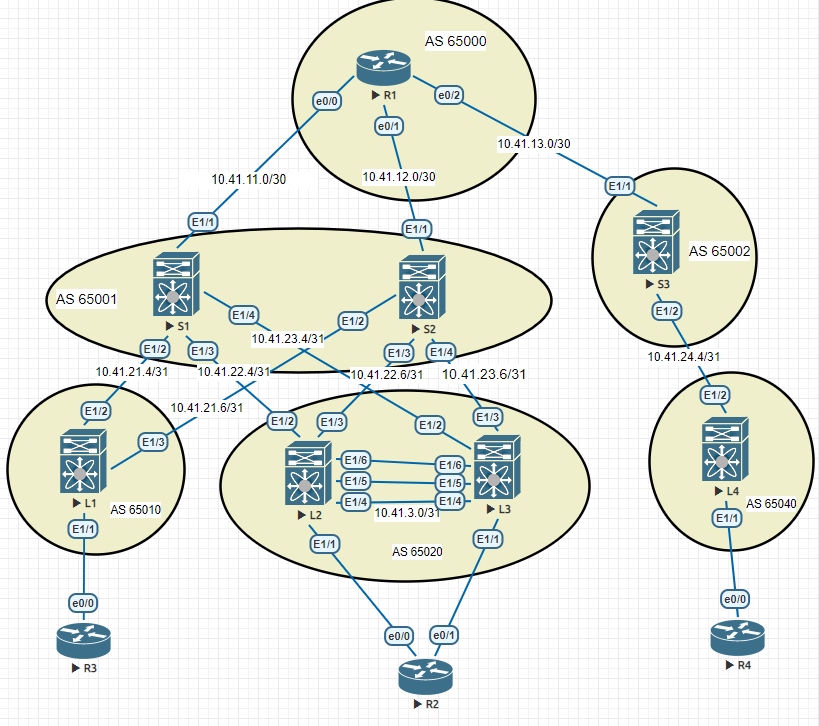

### Лабораторная 6
1. Настроить OVERLAY сеть по технологии VxLAN EVPN route-type 5
2. Настроить vpc между двумя LEAF

#### Топология сети

  
SPINE

<pre><code>
route-map UNC permit 10        //для построения туннеля между leaves, иначе маршрут упирается в SPINE
  set ip next-hop unchanged
!
router bgp 65001
!
  address-family ipv4 unicast
    network 10.41.1.1/32
    network 10.41.11.0/30
    network 10.41.21.4/31
    network 10.41.22.4/31
    network 10.41.23.4/31
  address-family l2vpn evpn
    retain route-target all
  template peer LEAF
    update-source loopback0
    address-family l2vpn evpn
      send-community
      send-community extended
      route-map UNC out
   neighbor 10.41.21.4
    inherit peer LEAF
    remote-as 65010
    address-family ipv4 unicast
   neighbor 10.41.22.4
    inherit peer LEAF
    remote-as 65020
    address-family ipv4 unicast
   neighbor 10.41.23.4
    inherit peer LEAF
    remote-as 65020
    address-family ipv4 unicast

</code></pre>

  
LEAF

<pre><code>
nv overlay evpn
feature bgp
feature pim
feature interface-vlan
feature vn-segment-vlan-based
feature lacp
feature vpc
feature nv overlay

vrf context KEEP

vpc domain 1
  peer-keepalive destination 10.41.3.2 source 10.41.3.1 vrf KEEP

interface port-channel99              //peer-link interface
  switchport mode trunk
  spanning-tree port type network
  vpc peer-link

interface port-channel1              //interface to client
  switchport mode trunk

interface Ethernet1/1
  description to_R2
  switchport mode trunk
  channel-group 1 mode active

interface Ethernet1/4                //vpc keep-alive interface
  description to_L2
  no switchport
  vrf member KEEP
  ip address 10.41.3.1/30
  no shutdown

interface Ethernet1/5
  switchport mode trunk
  channel-group 99 mode active

interface Ethernet1/6
  switchport mode trunk
  channel-group 99 mode active

interface loopback0
  ip address 10.41.0.2/32
  
interface loopback1
  ip address 2.2.2.2/32
  ip address 5.5.5.5/32 secondary     //одинаковый в vpc-паре
  
router bgp 65020
  address-family ipv4 unicast
    network 2.2.2.2/32
    network 5.5.5.5/32
    network 10.41.0.2/32
    network 10.41.22.4/31
    network 10.41.22.6/31
  template peer SPINE
    update-source loopback1
    ebgp-multihop 2
    address-family l2vpn evpn
      send-community
      send-community extended
  neighbor 10.41.22.5
    inherit peer SPINE
    remote-as 65001
    address-family ipv4 unicast
  neighbor 10.41.22.7
    inherit peer SPINE
    remote-as 65001
    address-family ipv4 unicast

evpn
  vni 10010 l2
    rd auto
    route-target import 9999:10010
    route-target export 9999:10010

vlan 10
  vn-segment 10010

</code></pre>

  
Router

<pre><code>
interface Port-channel1
 description to_LEAF
 switchport trunk encapsulation dot1q
 switchport mode trunk
!
interface Ethernet0/0
 description to_LEAF
 switchport trunk encapsulation dot1q
 switchport mode trunk
 channel-group 1 mode active
!
interface Ethernet0/1
 description to_LEAF
 switchport trunk encapsulation dot1q
 switchport mode trunk
 channel-group 1 mode active
!
interface Vlan10
 ip address 192.168.10.2 255.255.255.0

</code></pre>

