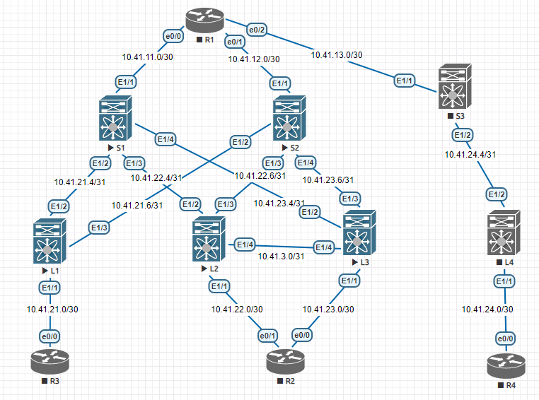

# MayNetArchi
### Лабораторная 1
1. Собрать топологию CLOS с 3 Spine и 4 Leaf. 3 Leaf подключены к 2 Spine. 1 Leaf подключен к оставшемуся Spine. Все Spine связаны между собой через дополнительный маршрутизатор.
2. 2 Leaf необходимо связать между собой для дальнейшей настройки VPC пары
3. Добавить 3 клиента будущей фабрики. Один клиент подключен к VPC паре. Остальные клиенты подключены к оставшимся Leaf
4. Распределить адресное пространство для Underlay сети

#### Топология сети

#### Адресация
Вид сети        | L1  | L2  |  L3 | L4  | S1  | S2  | S3  |  R1 |  R2 | R3  | R4
----------------|-----|-----|-----|-----|-----|-----|-----|-----|-----|-----|----
Сеть управления |mgmt0|mgmt0|mgmt0|mgmt0|mgmt0|mgmt0|mgmt0|mgmt0|mgmt0|mgmt0|mgmt0
10.41.20.0/24   | .5  | .2  | .3  | .4  | .6  | .7  | .8  | .1  | .9  | .10 | .11
Loopback        |-----|-----|-----|-----|-----|-----|-----|-----|-----|-----|-----
10.41.x.x/32    | .0.1| .0.2| .0.3| .0.4| .1.1| .1.2| .1.3| .2.1| .2.2| .2.3| .2.4

Транспортные сети

         |       S1      |       S2      |       S3      |       R1      |       R2      |       R3      |       R4      |
-------- | ------------- | ------------- | ------------- | ------------- | ------------- | ------------- | ------------- |
 L1      | 10.41.21.4/31 | 10.41.21.6/31 |               |               |               | 10.41.21.0/30 |               |
 L2      | 10.41.22.4/31 | 10.41.22.6/31 |               |               | 10.41.22.0/30 |               |               |
 L3      | 10.41.23.4/31 | 10.41.23.6/31 |               |               | 10.41.23.0/30 |               |               |
 L4      |               |               | 10.41.24.4/31 |               |               |               | 10.41.24.0/30 |
 S1      |               |               |               | 10.41.11.0/30 |               |               |               |
 S2      |               |               |               | 10.41.12.0/30 |               |               |               |
 S3      |               |               |               | 10.41.13.0/30 |               |               |               |
